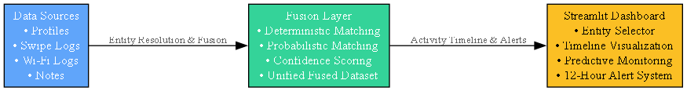
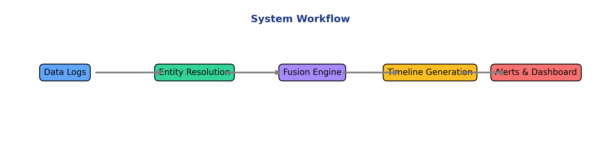

# Saptang-EntityResolution
Campus Entity Resolution &amp; Security Monitoring Prototype (Saptang Labs Challenge 2025)
# 🧾 Campus Entity Resolution & Security Monitoring System  
### Saptang Labs Product Development Challenge 2025  
**Team:** INFINITYv69  

---

## 🚀 Overview
This prototype unifies fragmented campus data—such as swipe logs, Wi-Fi records, and help-desk notes—into a single privacy-aware view of each entity.  
It performs **entity resolution**, **multi-modal data fusion**, and **predictive monitoring** to detect anomalies such as long inactivity periods.

---

## 🧩 Core Features
| Feature | Description |
|----------|-------------|
| 🔗 **Entity Resolution** | Links multiple identifiers (card ID, Wi-Fi, email) |
| 🧠 **Predictive Monitoring** | Predicts next likely campus location |
| ⏰ **Inactivity Alerts** | Flags entities inactive for > 12 hours |
| 🧩 **Explainability** | Shows data provenance and evidence |
| 🔒 **Privacy by Design** | Works on anonymized entity IDs |

---

## 🏗️ System Architecture


---

## 🔄 Workflow


---

## ⚙️ How to Run
```bash
pip install -r requirements.txt
streamlit run app.py
